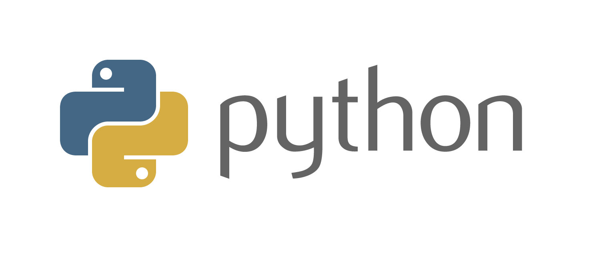

# Curso de Python

## [Section 01: Introducción](section_01_introduccion.md)  

* [Usar ``repl.it``](section_01_introduccion.md#usar-replit)
* [Numbers and printing](section_01_introduccion.md#numbers-and-printing)
* [Strings and string formating](section_01_introduccion.md#strings-and-string-formating)
* [Getting user input](section_01_introduccion.md#getting-user-input)
* [Booleans y comparaciones](section_01_introduccion.md#booleans-y-comparaciones)
* [List, tuples and sets](section_01_introduccion.md#list-tuples-and-sets)
* [Operaciones avanzadas con sets](section_01_introduccion.md#operaciones-avanzadas-con-sets)
* [Dictionaries](section_01_introduccion.md#dictionaries)

## [Section 02: Functions and Loops](section_02_functions_and_loops.md)

* [If statements](section_02_functions_and_loops.md#if-statements)
* [``bool()`` built-in function](section_02_functions_and_loop.mds#bool-built-in-function)
* [While loops](section_02_functions_and_loops.md#while-loops)
* [For loop, range() function and in keyword](section_02_functions_and_loops.md#for-loop-range-function-and-in-keyword)
* [Loops important keywords](section_02_functions_and_loops.md#loops-important-keywords)
* [List slicing](section_02_functions_and_loops.md#list-slicing)]
* [List comprehension](section_02_functions_and_loops.md#list-comprehension)
* [Set and Dictionary comprehension and zip() function](section_02_functions_and_loops.md#set-and-dictionary-comprehension-and-zip-function)
* [Functions and arguments](section_02_functions_and_loops.md#functions-and-arguments)
* [Functions: return values](section_02_functions_and_loops.md#functions-return-values)
* [Funciones Lambda y first-class](section_02_functions_and_loops.md#funciones-lambda-y-first-class)

## [Section 04: Object Oriented Programming](section_04_object_oriented_programming.md)

* [Introduccion a Programacion Orientada a Objetos](section_04_object_oriented_programming.md#introduccion-a-programacion-orientada-a-objetos)
* [Metodos especiales - dunder methods](section_04_object_oriented_programming.md#metodos-especiales-dunder-methods)
* [Herencia](section_04_object_oriented_programming.md#herencia)
* [Decorador Property](section_04_object_oriented_programming.md#decorador-property)
* [Decoradores classmethod y staticmethod](section_04_object_oriented_programming.md#decoradores-classmethod-y-staticmethod)

## [Section 05: Errors in Python](section_05_errors.md)

* [Introduccion](section_05_errors.md#introduccion)
* [Built-in errors](section_05_errors.md#built-in-errors)
* [Raising erros](section_05_errors.md#raising-errors)
* [Creando nuestros propios errores y docstrings](section_05_errors.md#creando-nuestros-propios-errores-y-docstrings)
* [Dealing with errors](section_05_errors.md#dealing-with-errors)
*  [Success block and re-raising exceptions](section_05_errors.md#success-block-and-re-raising-exceptions)
* [Debugging en PyCharm](section_05_errors.md#debugging-en-pycharm)

## [Section 06: Files in Python](section_06_files.md)

* [Files (Open - read - write)](section_06_files.md#files-open---read---write)
* [Copiar archivos](section_06_files.md#copiar-archivos)
* [Archivos CSV](section_06_files.md#archivos-csv)
* [Archivos JSON](section_06_files.md#archivos-json)
* [Usando la sintaxis with - context managers](section_06_files.md#usando-la-sintaxis-with---context-managers)
* [Importar nuestros propios archivos](section_06_files.md#importar-nuestros-propios-archivos)
* [Relative imports](section_06_files.md#relative-imports)
* [Import Errors](section_06_files.md#import-errors)

## [Section 07: Milestone Project 2 - Databases](section_07_databases.md)

* [Milestone: Project 2 (en memoria)](section_07_databases.md#milestone-project-2-en-memoria)
* [Milestone: Project 2 (en un CSV file)](section_07_databases.md#milestone-project-2-en-un-csv-file)
* [Milestone: Project 2 (en un Json file)](section_07_databases.md#milestone-project-2-en-un-json-file)
* [Developing Context Manager](section_07_databases.md#developing-context-manager)

## [Section 09: Advance Built in Functions](section_09_advance_built_in_functions.md)

* [Generators](section_09_advance_built_in_functions.md#generators)
* [Generators classes and iterators](section_09_advance_built_in_functions.md#generators-classes-and-iterators)
* [Iterables](section_09_advance_built_in_functions.md#iterables)
* [Filter function](section_09_advance_built_in_functions.md#filter-function)
* [Map function](section_09_advance_built_in_functions.md#map-function)
* [any and all functions](section_09_advance_built_in_functions.md#any-and-all-functions)
* [enumerate function](section_09_advance_built_in_functions.md#enumerate-function)

## [Section 10: Advance Python Development](section_10_advance_python_development.md)

* [Mutability](section_10_advance_python_development.md#mutability)
* [Argument Mutability](section_10_advance_python_development.md#argument-mutability)
* [Default values for parameters](section_10_advance_python_development.md#default-values-for-parameters)
* [Mutable default arguments - Bad idea](section_10_advance_python_development.md#mutable-default-arguments)
* [Argument unpacking](section_10_advance_python_development.md#argument-unpacking)
* [Collections](section_10_advance_python_development.md#collections)
* [Timezones, datetime](section_10_advance_python_development.md#timezones-and-datetime)
* [Timing your code](section_10_advance_python_development.md#timing-your-code)
* [Regular expressions](section_10_advance_python_development.md#regular-expressions)
* [Logging](section_10_advance_python_development.md#logging)
* [Mas sobre logging](section_10_advance_python_development.md#mas-sobre-logging)
* [Ejemplo como usar los logs en una applicacion](section_10_advance_python_development.md#ejemplo-como-usar-los-logs-en-una-applicacion)
* [Ejemplo Rotating Log](section_10_advance_python_development.md#ejemplo-rotating-log)
* [Mas sobre Regular Expressions](section_10_advance_python_development.md#mas-sobre-regular-expressions)

## [Section 11: Web Scraping](section_11_web_scraping.md)
* [Understanding HTML con BeautifulSoup](section_11_web_scraping.md#understanding-html-con-beautifuldsoup)
* [More complex Html parsing](section_11_web_scraping.md#more-complex-html-parsing)
* [Estructurar el parseador en forma correcta](section_11_web_scraping.md#estructurar-el-parseador-en-forma-correcta)
* [Extraer los locators](section_11_web_scraping.md#extraer-los-locators)
* [Entendiendo HTML usando el browser](section_11_web_scraping.md#entendiendo-html-usando-el-browser)
* [Scrapping our first WebSite](section_11_web_scraping.md#scrapping-our-first-website)
* [Project: Quotes Scraper](section_11_web_scraping.md##project-quotes-scraper)

## Referencias

[Curso Udamy - The Complete Python Course | Learn Python by Doing](https://www.udemy.com/the-complete-python-course/learn/v4/content)  
[Python Loggings Basics by Corey Schafer](https://www.youtube.com/playlist?list=PL-osiE80TeTv5x_nJb-mtaEKg9Gi_-Nsh)
[Github - tecladocode -complete-python-course](https://github.com/tecladocode/complete-python-course)
