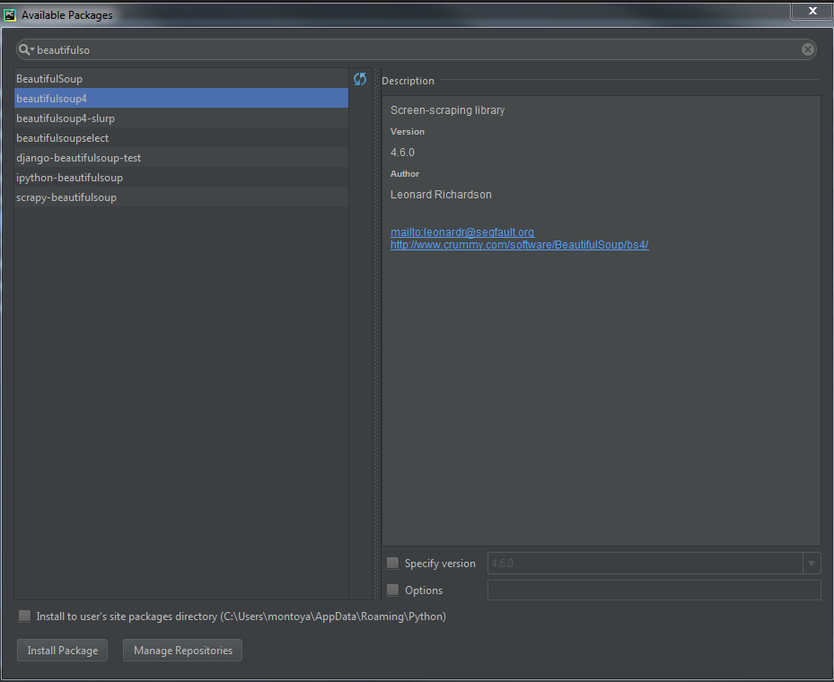
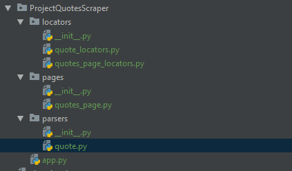

# Section 11: Web Scraping

[VOLVER a README.md](README.md)

## Indice

* [Understanding HTML con BeautifulSoup](#understanding-html-con-beautifuldsoup)
* [More complex Html parsing](#more-complex-html-parsing)
* [Estructurar el parseador en forma correcta](#estructurar-el-parseador-en-forma-correcta)
* [Extraer los locators](#extraer-los-locators)
* [Entendiendo HTML usando el browser](#entendiendo-html-usando-el-browser)
* [Scrapping our first WebSite](#scrapping-our-first-website)
* [Project: Quotes Scraper](#project-quotes-scraper)
* [Project: Books scraper project](#project-books-scraper-project)


## Understanding HTML con BeautifulSoup

* Instalar la libreria ``beautifulsoup4``



* Ejemplo Simple como usar BeautifulSoup:

```python
from bs4 import BeautifulSoup

SIMPLE_HTML = '''<html>
<head></head>
<body>
<h1>This is a title</h1>
<p class="subtitle">Lorem ipsum dolor sit amet. Consectetur edipiscim elit.</p>
<p>Here's another p without a class</p>
<ul>
    <li>Rolf</li>
    <li>Charlie</li>
    <li>Jen</li>
    <li>Jose</li>
</ul>
</body>
</html>'''


simple_soup = BeautifulSoup(SIMPLE_HTML, 'html.parser')

# Find a simple element
print(simple_soup.find('h1'))
print(simple_soup.find('h1').string)
print(simple_soup.find('li'))
print('\n')

# Find multiple elements
all_lis = simple_soup.find_all('li')
for li in all_lis:
    print(li)
    print(li.string)
print('\n')
```

**OUTPUT:**

```console
<h1>This is a title</h1>
This is a title
<li>Rolf</li>


<li>Rolf</li>
Rolf
<li>Charlie</li>
Charlie
<li>Jen</li>
Jen
<li>Jose</li>
Jose


Process finished with exit code 0
```

```python
from bs4 import BeautifulSoup

SIMPLE_HTML = '''<html>
<head></head>
<body>
<h1>This is a title</h1>
<p class="subtitle">Lorem ipsum dolor sit amet. Consectetur edipiscim elit.</p>
<p>Here's another p without a class</p>
<ul>
    <li>Rolf</li>
    <li>Charlie</li>
    <li>Jen</li>
    <li>Jose</li>
</ul>
</body>
</html>'''


simple_soup = BeautifulSoup(SIMPLE_HTML, 'html.parser')


def find_title():
    h1_tag = simple_soup.find('h1')
    print(h1_tag.string)


def find_list_items():
    list_items = [item.string for item in simple_soup.find_all('li')]
    print(list_items)


def find_all_paragraphs():
    all_paragraphs = [paragraph.string for paragraph in simple_soup.find_all('p')]
    print(all_paragraphs)


def find_subtitle():
    paragraph = simple_soup.find('p', {'class': 'subtitle'})
    print(paragraph.string)


def find_other_paragraph():
    all_paragraphs = simple_soup.find_all('p')
    other_paragraphs = [paragraph.string for paragraph in all_paragraphs if 'subtitle' not in paragraph.attrs.get('class', [])]
    print(other_paragraphs)


if __name__ == '__main__':
    find_title()
    find_list_items()
    find_all_paragraphs()
    find_subtitle()
    find_other_paragraph()
```

**OUTPUT:**

```console
This is a title
['Rolf', 'Charlie', 'Jen', 'Jose']
['Lorem ipsum dolor sit amet. Consectetur edipiscim elit.', "Here's another p without a class"]
Lorem ipsum dolor sit amet. Consectetur edipiscim elit.
["Here's another p without a class"]

Process finished with exit code 0
```

[Video: Understanding HTML con BeautifulSoup](https://www.udemy.com/the-complete-python-course/learn/v4/t/lecture/9477874?start=0)

## More complex Html parsing

Los ejemplos siguientes muestran como parsear objetos ``html`` utilizando ``CSS Locators``:

```python
import re
from bs4 import BeautifulSoup


ITEM_HTML = '''<html><head></head><body>
<li class="col-xs-6 col-sm-4 col-md-3 col-lg-3">
    <article class="product_pod">
            <div class="image_container">
                    <a href="catalogue/a-light-in-the-attic_1000/index.html">
                        
                    </a>
            </div>
            <p class="star-rating Three">
                <i class="icon-star"></i>
                <i class="icon-star"></i>
                <i class="icon-star"></i>
                <i class="icon-star"></i>
                <i class="icon-star"></i>
            </p>
            <h3><a href="catalogue/a-light-in-the-attic_1000/index.html" title="A Light in the Attic">A Light in the ...</a></h3>
            <div class="product_price">
                <p class="price_color">£51.77</p>
                <p class="instock availability">
                    <i class="icon-ok"></i>
                    In stock
                </p>
                <form>
                    <button type="submit" class="btn btn-primary btn-block" data-loading-text="Adding...">Add to basket</button>
                </form>
            </div>
    </article>
</li>
</body></html>
'''

soup = BeautifulSoup(ITEM_HTML, 'html.parser')


def find_item_name():
    locator = 'article.product_pod h3 a'  # CSS locator
    item_link = soup.select_one(locator)
    item_name = item_link.attrs['title']

    print(item_link)
    print(item_link.string)
    print(item_name)
    print('\n')


def find_item_link():
    locator = 'article.product_pod h3 a'  # CSS locator
    item_link = soup.select_one(locator).attrs['href']
    print(item_link)
    print('\n')


def find_item_price():
    locator = 'article.product_pod div.product_price p.price_color'  # CSS locator
    item_price = soup.select_one(locator).string
    print(item_price)

    pattern = '£(\d+\.\d+)'
    matches = re.search(pattern, item_price)
    print(matches.group(0))  # entire match
    print(float(matches.group(1)))
    print('\n')


def find_item_rating():
    locator = 'article.product_pod p.star-rating'
    star_rating_tag = soup.select_one(locator)
    classes = star_rating_tag.attrs['class']  # ['star-rating', 'Three']
    value = [class_item for class_item in classes if class_item != 'star-rating'][0]
    print(value)
    print('\n')


if __name__ == '__main__':
    find_item_name()
    find_item_link()
    find_item_price()
    find_item_rating()
```
**OUTPUT:**

```console
<a href="catalogue/a-light-in-the-attic_1000/index.html" title="A Light in the Attic">A Light in the ...</a>
A Light in the ...
A Light in the Attic


catalogue/a-light-in-the-attic_1000/index.html


£51.77
£51.77
51.77


Three

Process finished with exit code 0
```

[Video: More complex HTML parsing](https://www.udemy.com/the-complete-python-course/learn/v4/t/lecture/9477876?start=0)

## Estructurar el parseador en forma correcta

La idea es crear una clase que reciba la pagina o parte de la pagina y llamar propiedades de la clase para obtener los valores.

```python
import re
from bs4 import BeautifulSoup


ITEM_HTML = '''<html><head></head><body>
<li class="col-xs-6 col-sm-4 col-md-3 col-lg-3">
    <article class="product_pod">
            <div class="image_container">
                    <a href="catalogue/a-light-in-the-attic_1000/index.html">
                        
                    </a>
            </div>
            <p class="star-rating Three">
                <i class="icon-star"></i>
                <i class="icon-star"></i>
                <i class="icon-star"></i>
                <i class="icon-star"></i>
                <i class="icon-star"></i>
            </p>
            <h3><a href="catalogue/a-light-in-the-attic_1000/index.html" title="A Light in the Attic">A Light in the ...</a></h3>
            <div class="product_price">
                <p class="price_color">£51.77</p>
                <p class="instock availability">
                    <i class="icon-ok"></i>
                    In stock
                </p>
                <form>
                    <button type="submit" class="btn btn-primary btn-block" data-loading-text="Adding...">Add to basket</button>
                </form>
            </div>
    </article>
</li>
</body></html>
'''


class ParsedItem:
    """
    A class to take in an HTML page (or part of it), and find properties of an item in it
    """

    def __init__(self, page):
        self.soup = BeautifulSoup(ITEM_HTML, 'html.parser')

    @property
    def name(self):
        locator = 'article.product_pod h3 a'  # CSS locator
        item_link = self.soup.select_one(locator)
        item_name = item_link.attrs['title']
        return item_name

    @property
    def link(self):
        locator = 'article.product_pod h3 a'  # CSS locator
        item_link = self.soup.select_one(locator).attrs['href']
        return item_link

    @property
    def price(self):
        locator = 'article.product_pod div.product_price p.price_color'  # CSS locator
        item_price = self.soup.select_one(locator).string

        pattern = '£(\d+\.\d+)'
        matches = re.search(pattern, item_price)
        return float(matches.group(1))

    @property
    def rating(self):
        locator = 'article.product_pod p.star-rating'
        star_rating_tag = self.soup.select_one(locator)
        classes = star_rating_tag.attrs['class']  # ['star-rating', 'Three']
        rating_classes = [class_item for class_item in classes if class_item != 'star-rating']
        return rating_classes[0]


if __name__ == '__main__':
    item = ParsedItem(ITEM_HTML)

    print(item.name)
    print(item.link)
    print(item.rating)
    print(item.price)

```

**OUTPUT:**

```console
A Light in the Attic
catalogue/a-light-in-the-attic_1000/index.html
Three
51.77

Process finished with exit code 0
```
[Video: Estructurando el parseador de una forma m'as ordenada](https://www.udemy.com/the-complete-python-course/learn/v4/t/lecture/9477886?start=0)

## Extraer los locators

Al generar una clase que contenga los los locators, facilita el mantenimiento del código en caso que la pagina que se esta haciendo el scrapping cambie debido a que no hay que revisar todo el código sino modificar solo los locators.

```python
import re
from bs4 import BeautifulSoup


ITEM_HTML = '''<html><head></head><body>
<li class="col-xs-6 col-sm-4 col-md-3 col-lg-3">
    <article class="product_pod">
            <div class="image_container">
                    <a href="catalogue/a-light-in-the-attic_1000/index.html">
                        
                    </a>
            </div>
            <p class="star-rating Three">
                <i class="icon-star"></i>
                <i class="icon-star"></i>
                <i class="icon-star"></i>
                <i class="icon-star"></i>
                <i class="icon-star"></i>
            </p>
            <h3><a href="catalogue/a-light-in-the-attic_1000/index.html" title="A Light in the Attic">A Light in the ...</a></h3>
            <div class="product_price">
                <p class="price_color">£51.77</p>
                <p class="instock availability">
                    <i class="icon-ok"></i>
                    In stock
                </p>
                <form>
                    <button type="submit" class="btn btn-primary btn-block" data-loading-text="Adding...">Add to basket</button>
                </form>
            </div>
    </article>
</li>
</body></html>
'''


class ParsedItemLocators:
    """
    Locators for an item in the HTML page.
    This allows us to easily see what our code will be looking at
    as well as change it quickly if we notice it is now different.
    """
    NAME_LOCATOR = 'article.product_pod h3 a'
    LINK_LOCATOR = 'article.product_pod h3 a'
    PRICE_LOCATOR = 'article.product_pod div.product_price p.price_color'
    RATING_LOCATOR = 'article.product_pod p.star-rating'


class ParsedItem:
    """
    A class to take in an HTML page (or part of it), and find properties of an item in it
    """

    def __init__(self, page):
        self.soup = BeautifulSoup(page, 'html.parser')

    @property
    def name(self):
        locator = ParsedItemLocators.NAME_LOCATOR
        item_link = self.soup.select_one(locator)
        item_name = item_link.attrs['title']
        return item_name

    @property
    def link(self):
        locator = ParsedItemLocators.LINK_LOCATOR  # CSS locator
        item_link = self.soup.select_one(locator).attrs['href']
        return item_link

    @property
    def price(self):
        locator = ParsedItemLocators.PRICE_LOCATOR # CSS locator
        item_price = self.soup.select_one(locator).string

        pattern = '£(\d+\.\d+)'
        matches = re.search(pattern, item_price)
        return float(matches.group(1))

    @property
    def rating(self):
        locator = ParsedItemLocators.RATING_LOCATOR
        star_rating_tag = self.soup.select_one(locator)
        classes = star_rating_tag.attrs['class']  # ['star-rating', 'Three']
        rating_classes = [class_item for class_item in classes if class_item != 'star-rating']
        return rating_classes[0]


if __name__ == '__main__':
    item = ParsedItem(ITEM_HTML)

    print(item.name)
    print(item.link)
    print(item.rating)
    print(item.price)
``` 
**OUTPUT:**

```console
A Light in the Attic
catalogue/a-light-in-the-attic_1000/index.html
Three
51.77

Process finished with exit code 0
```
[Video: Separar los locators de la clase parser:](https://www.udemy.com/the-complete-python-course/learn/v4/t/lecture/9477888?start=0)

## Entendiendo HTML usando el browser

[Video: Understanding HTML with the browser](https://www.udemy.com/the-complete-python-course/learn/v4/t/lecture/9477890?start=0)

## Scrapping our first WebSite

> **NOTA:** Para poder abrir el contenido de una pagina web es necesario importar la librería ``requests``
```python
import requests
from bs4 import BeautifulSoup

page = requests.get('http://www.example.com/')
print(page.content)

soup = BeautifulSoup(page.content, 'html.parser')
print(soup.find('h1').string)
print(soup.select_one('p a').attrs['href'])
```

**OUTPUT:**

```console
b'<!doctype html>\n<html>\n<head>\n    <title>Example Domain</title>\n\n    <meta charset="utf-8" />\n    <meta http-equiv="Content-type" content="text/html; charset=utf-8" />\n    <meta name="viewport" content="width=device-width, initial-scale=1" />\n    <style type="text/css">\n    body {\n        background-color: #f0f0f2;\n        margin: 0;\n        padding: 0;\n        font-family: "Open Sans", "Helvetica Neue", Helvetica, Arial, sans-serif;\n        \n    }\n    div {\n        width: 600px;\n        margin: 5em auto;\n        padding: 50px;\n        background-color: #fff;\n        border-radius: 1em;\n    }\n    a:link, a:visited {\n        color: #38488f;\n        text-decoration: none;\n    }\n    @media (max-width: 700px) {\n        body {\n            background-color: #fff;\n        }\n        div {\n            width: auto;\n            margin: 0 auto;\n            border-radius: 0;\n            padding: 1em;\n        }\n    }\n    </style>    \n</head>\n\n<body>\n<div>\n    <h1>Example Domain</h1>\n    <p>This domain is established to be used for illustrative examples in documents. You may use this\n    domain in examples without prior coordination or asking for permission.</p>\n    <p><a href="http://www.iana.org/domains/example">More information...</a></p>\n</div>\n</body>\n</html>\n'
Example Domain
http://www.iana.org/domains/example

Process finished with exit code 0

```
[Video: Scrapping our first WebSite](https://www.udemy.com/the-complete-python-course/learn/v4/t/lecture/9477894?start=0)


## Project: Quotes Scraper

### Estructura del proyecto:



### Defininir los locators

* ``quotes_page_locators.py``
```python
class QuotesPageLocators:
    QUOTE = 'div.quote'
```

* ``quote_locators.py``
```python
class QuoteLocators:
    AUTHOR = 'small.author'
    CONTENT = 'span.text'
    TAGS = 'div.tags a.tag'
```
 
### Definir el Quote parser

* ``quote.py``

```python
from Section_11_Web_Scraping.ProjectQuotesScraper.locators.quote_locators import QuoteLocators
from bs4 import BeautifulSoup


class QuoteParser:
    """
    Given one of the specific quote divs(page_section), find out the data about the quote (quote content, author, tags).
    """

    def __init__(self, page_section: BeautifulSoup):
        self.page_section = page_section

    def __repr__(self):
        return f'<Quote {self.content}, by {self.author}>'

    @property
    def content(self):
        locator = QuoteLocators.CONTENT
        return self.page_section.select_one(locator).string

    @property
    def author(self):
        locator = QuoteLocators.AUTHOR
        return self.page_section.select_one(locator).string

    @property
    def tags(self):
        locator = QuoteLocators.TAGS
        return [tag.string for tag in self.page_section.select(locator)]
        
        
```

### Definir la Quote page

* ``quote_page.py``

```python
from bs4 import BeautifulSoup

from Section_11_Web_Scraping.ProjectQuotesScraper.locators.quotes_page_locators import QuotesPageLocators
from Section_11_Web_Scraping.ProjectQuotesScraper.parsers.quote import QuoteParser


class QuotePage:
    def __init__(self, page):
        self.soup = BeautifulSoup(page, 'html.parser')

    @property
    def quotes(self):
        locator = QuotesPageLocators.QUOTE
        quotes = self.soup.select(locator)
        return [QuoteParser(quote) for quote in quotes]


```

### Integrar la aplicación

* ``app.py``

```python
import requests
from Section_11_Web_Scraping.ProjectQuotesScraper.pages.quotes_page import QuotePage


if __name__ == '__main__':
    page_content = requests.get('http://quotes.toscrape.com').content
    page = QuotePage(page_content)

    for quote in page.quotes:
        print(quote)

```
**OUTPUT:**

```console
<Quote “The world as we have created it is a process of our thinking. It cannot be changed without changing our thinking.”, by Albert Einstein>
<Quote “It is our choices, Harry, that show what we truly are, far more than our abilities.”, by J.K. Rowling>
<Quote “There are only two ways to live your life. One is as though nothing is a miracle. The other is as though everything is a miracle.”, by Albert Einstein>
<Quote “The person, be it gentleman or lady, who has not pleasure in a good novel, must be intolerably stupid.”, by Jane Austen>
<Quote “Imperfection is beauty, madness is genius and it's better to be absolutely ridiculous than absolutely boring.”, by Marilyn Monroe>
<Quote “Try not to become a man of success. Rather become a man of value.”, by Albert Einstein>
<Quote “It is better to be hated for what you are than to be loved for what you are not.”, by André Gide>
<Quote “I have not failed. I've just found 10,000 ways that won't work.”, by Thomas A. Edison>
<Quote “A woman is like a tea bag; you never know how strong it is until it's in hot water.”, by Eleanor Roosevelt>
<Quote “A day without sunshine is like, you know, night.”, by Steve Martin>

Process finished with exit code 0

```

[Video: Milestone Project: A Quote Scraper](https://www.udemy.com/the-complete-python-course/learn/v4/t/lecture/9477898?start=0)  
[Video: Estructurando una app de scraping](https://www.udemy.com/the-complete-python-course/learn/v4/t/lecture/9477906?start=0)  
[Video: Definiendo los locators](https://www.udemy.com/the-complete-python-course/learn/v4/t/lecture/9477914?start=0)  
[Video: Definir el Quote parser](https://www.udemy.com/the-complete-python-course/learn/v4/t/lecture/9477920?start=0)  
[Video: The Quotes page](https://www.udemy.com/the-complete-python-course/learn/v4/t/lecture/9477928?start=0)  
[Video: Recap the Quote project](https://www.udemy.com/the-complete-python-course/learn/v4/t/lecture/9477942?start=0)


## Project: Books scraper project

### Estructura del proyecto:


### Defininir los locators

* ``book_locators.py``
```python
class BookLocators:
    NAME_LOCATOR = 'article.product_pod h3 a'
    LINK_LOCATOR = 'article.product_pod h3 a'
    PRICE_LOCATOR = 'article.product_pod p.price_color'
    RATING_LOCATOR = 'article.product_pod p.star-rating'
```

* ``all_books_page_locators.py``
```python
class AllBooksPageLocators:
    BOOKS = 'div.page div.page_inner section li.col-xs-6.col-sm-4.col-md-3.col-lg-3'
```

### Defininir los locators

* ``all_books_page.py``

```python
from bs4 import BeautifulSoup
from Section_11_Web_Scraping.ProjectBooksScraper.locators.all_books_page_locators import AllBooksPageLocators
from Section_11_Web_Scraping.ProjectBooksScraper.parsers.book_parser import BookParser


class AllBooksPage:
    def __init__(self, page_content):
        self.soup = BeautifulSoup(page_content, 'html.parser')

    @property
    def books(self):
        return [BookParser(e) for e in self.soup.select(AllBooksPageLocators.BOOKS)]
```

### Crear el book parser

```python
import re
from Section_11_Web_Scraping.ProjectBooksScraper.locators.book_locators import BookLocators


class BookParser:
    """
    A class to take in an HTML page (or part of it), and find properties of an item in it
    """

    RATINGS = {
        'One': 1,
        'Two': 2,
        'Three': 3,
        'Four': 4,
        'Five': 5
    }

    def __init__(self, parent):
        self.parent = parent
        
    def __repr__(self):
        return f'<Book {self.name}, £{self.price}, ({self.rating} stars) >'

    @property
    def name(self):
        locator = BookLocators.NAME_LOCATOR
        item_link = self.parent.select_one(locator)
        item_name = item_link.attrs['title']
        return item_name

    @property
    def link(self):
        locator = BookLocators.LINK_LOCATOR
        item_link = self.parent.select_one(locator).attrs['href']
        return item_link

    @property
    def price(self):
        locator = BookLocators.PRICE_LOCATOR
        item_price = self.parent.select_one(locator).string  # £51.77

        pattern = '£(\d+\.\d+)'
        matches = re.search(pattern, item_price)
        return float(matches.group(1))

    @property
    def rating(self):
        locator = BookLocators.RATING_LOCATOR
        star_rating_tag = self.parent.select_one(locator)
        classes = star_rating_tag.attrs['class']  # ['star-rating', 'Three']
        rating_classes = [class_item for class_item in classes if class_item != 'star-rating']
        rating_number = BookParser.RATINGS.get(rating_classes[0])
        return rating_number
```

> NOTA: la ``@property`` ``books``  devuelve una lista de ``Booksparser`` (``BeatifulSoup`` objects)

### Crear el app

* ```app.py```

```python

import requests
from Section_11_Web_Scraping.ProjectBooksScraper.pages.all_books_page import AllBooksPage


page_content = requests.get('http://books.toscrape.com').content
page = AllBooksPage(page_content)

books = page.books

for book in books:
    print(book)

```

### Ordenar los libros

* ``menu.py``

```python
from Section_11_Web_Scraping.ProjectBooksScraper.app import books


def print_best_books():
    best_books = sorted(books, key=lambda x: (x.rating * -1, x.price))[:10]  # * -1 ordena en forma descendente,
    for book in best_books:
        print(book)


def print_cheapest_books():
    cheapest_books = sorted(books, key=lambda x: (x.price, x.rating * -1))[:10]  # la tuple es multiple sort
    for book in cheapest_books:
        print(book)


print('--- BEST ---')
print_best_books()
print('--- CHEAPEST ---')
print_cheapest_books()

```

### Crear el menu

* ``menu.py``

```python
from Section_11_Web_Scraping.ProjectBooksScraper.app import books


USER_CHOICE = '''

Enter one of the following

- 'b' to look at 5-star books
- 'c' to look at the cheapest books
- 'n' to just get the next available book on the catalogue
- 'q' to exit

Enter your choice: '''


def print_best_books():
    best_books = sorted(books, key=lambda x: (x.rating * -1, x.price))[:10]  # * -1 ordena en forma descendente,
    for book in best_books:
        print(book)


def print_cheapest_books():
    cheapest_books = sorted(books, key=lambda x: (x.price, x.rating * -1))[:10]  # la tuple es multiple sort
    for book in cheapest_books:
        print(book)


books_generator = (x for x in books)


def get_next_book():
    print(next(books_generator))


def menu():
    user_input = input(USER_CHOICE)
    while user_input != 'q':
        if user_input == 'b':
            print('--- BEST ---')
            print_best_books()
        elif user_input == 'c':
            print('--- CHEAPEST ---')
            print_cheapest_books()
        elif user_input == 'n':
            print('--- NEXT BOOK IN CATALOGUE ---')
            get_next_book()
        else:
            print('--- INVALID OPTION SELECTED ---')

        user_input = input(USER_CHOICE)


if __name__ == '__main__':
    menu()

```

### Mejorar el menu

* ``menu.py``
```python

...

user_choices ={
    'b': print_best_books,
    'c': print_cheapest_books,
    'n': get_next_book
}


def print_invalid_option():
    print('--- INVALID OPTION SELECTED ---')
    print('Please choose a valid command.')


def menu():
    user_input = input(USER_CHOICE)
    while user_input != 'q':
        user_choices.get(user_input, print_invalid_option)()
        user_input = input(USER_CHOICE)

```


[Video 1: Book Scraper + application](https://www.udemy.com/the-complete-python-course/learn/v4/t/lecture/9477954?start=0)  
[Video 2: HTML Locators](https://www.udemy.com/the-complete-python-course/learn/v4/t/lecture/9477964?start=0)  
[Video 3: Creating the Locators](https://www.udemy.com/the-complete-python-course/learn/v4/t/lecture/9477978?start=0)  
[Video 4: Creating our Book Page](https://www.udemy.com/the-complete-python-course/learn/v4/t/lecture/9477984?start=0)  
[Video 5: Creating our Book Parser](https://www.udemy.com/the-complete-python-course/learn/v4/t/lecture/9477994?start=0)  
[Video 6: Writing our app file](https://www.udemy.com/the-complete-python-course/learn/v4/t/lecture/9477998?start=0)  
[Video 7: Sorting the books](https://www.udemy.com/the-complete-python-course/learn/v4/t/lecture/9478004?start=0)  
[Video 8: Construyendo el menu](https://www.udemy.com/the-complete-python-course/learn/v4/t/lecture/9478008?start=0)  
[Video 9: Una mejor forma de crear el menu](https://www.udemy.com/the-complete-python-course/learn/v4/t/lecture/9478012?start=0)


## Referencias:
[Github - tecladocode -complete-python-course](https://github.com/tecladocode/complete-python-course/tree/master/section11/projects)